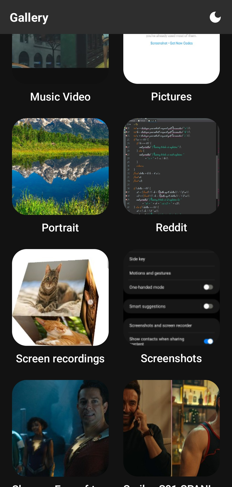
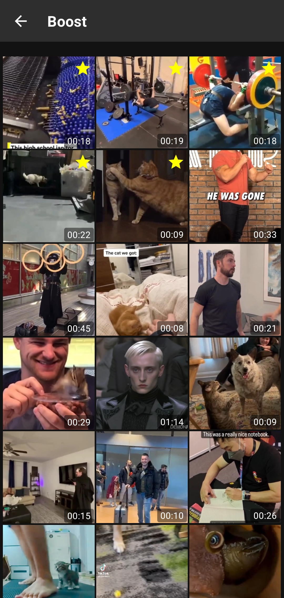

## Features of the app

- Show all images and videos (media) organized by buckets
- Sort media in buckets by name, last modified or size
- Favorite media
  - Favorite media will be on top the list
  - Long click on media to set favorite or remove favorite
- Light/Dark theme

## Compiled apk file (for convenience) at: /app/release/

## Features to add / To improve:

- Copy, move, delete media
- Cache media into local database
- Improve thumbnail loadings and caching

## Screenshots:

    
    

